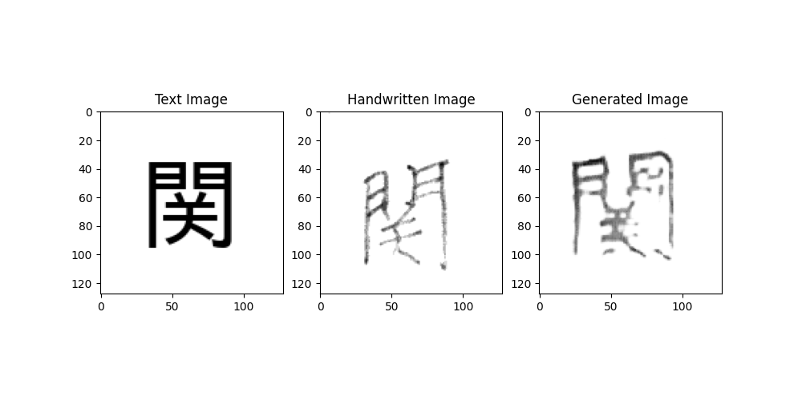

# Japanese Handwriting Generator
A generative neural net to convert Japanese kanji into handwritten-style digits and generate new Japanese kanji in a handwritten style.

## Implementation Details
The model is an implementation of a Pix2Pix neural network (Citation 1). The data is from the ETL Character Database (Citation 2), specifically ETL8G. Everything was tested on Python 3.8 with CUDA 11.3.

## How to use
1. Get access to the ETL Character Database, and download ETL8.
2. Use the [ETLCDB Image Extractor](https://github.com/choo/etlcdb-image-extractor) to extract the images, then place them in the data/ folder in this repository.
3. Download the Takao Gothic font, and place the TakaoGothic.tff file in the root directory of this repository.
4. Run `python add_starting_images.py` to generate the font images.
5. Run `python accumulate_data.py` to aggregate the data into one .npy file. (It might require 21 GB of free ram...)
6. Run `python main.py --train` to actually train the model.
6. Run `python main.py --gen --load` to generate using a trained model.

## Results (WIP)

## Sources Used
1. [Image-to-Image Translation with Conditional Adversarial Networks](https://arxiv.org/abs/1611.07004)
2. [ETL Character Database](http://etlcdb.db.aist.go.jp/)